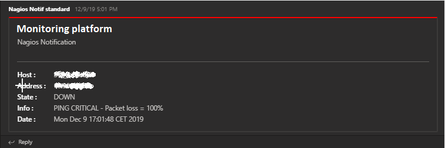

# Analyze notification alert

## Technical

This examples concern technicals notifications examples only.

### SMS / Email

SMS and Email notifications are quite similar, so, they are grouped in one unique example.

```text
Monitoring platform

Host: RGM_HOST
Host address: 127.0.0.1
Host status: DOWN

Info: CRITICAL - Host Unreachable (127.0.0.1)

Date: Mon Jan 27 09:55:00 CET 2020
```

On this notification, we could read theses informations :

- Host : Provide host name entered in monitoring platform. __This is the field to permit searches__
- Host address : IP address or DNS name of host configured into monitoring platform. Could be used to make a global search (for host with integrated childs such as databases for example)
- Host status : Status of host detected for this notification. Could be _UP_, _DOWN_ or _UNREACHABLE_.
- Info : Additionnal check return informations. For hosts, this field as no great importances.
- Date : Event date provided by monitoring platform. Correspond to event detection in most of cases.

### Teams



For teams notifications, we could find add fields quite similar to [SMS / Email](#sms--email). No need to detail again.

### Slack

```text
Monitoring notification
:emoji: $ (DOWN) on RGM_HOST (127.0.0.1)
Date: Mon Jan 27 09:55:00 CET 2020 Additional Info: CRITICAL - Host Unreachable (127.0.0.1)
```

For slack notifications, we can find all similars informations, but condensed.

- `:emoji: $ (DOWN) on RGM_HOST (127.0.0.1)` : We find host state (DOWN), host name (RGM_HOST) and host address (127.0.0.1) on this line
- `Date: Mon Jan 27 09:55:00 CET 2020 Additional Info: CRITICAL - Host Unreachable (127.0.0.1)` : We find event date and additionnal informations on this line.
