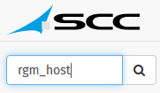

# Search host from name

When you know host or service included in monitoring platform, you could use search engine included into website.  
This search engine is placed in __top right__ of website and looks like than :  

So, just fill with known hostname. For example with host _RGM\_HOST_ :

Then tap on __Enter__ keyboard key or click on __magnifying glass__.  
You'll be redirected on page with all hosts matching your search.  

At this step, you'll visualize all hosts informations (host and services associated).
