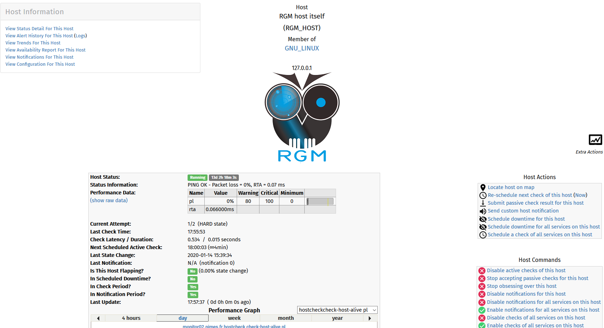
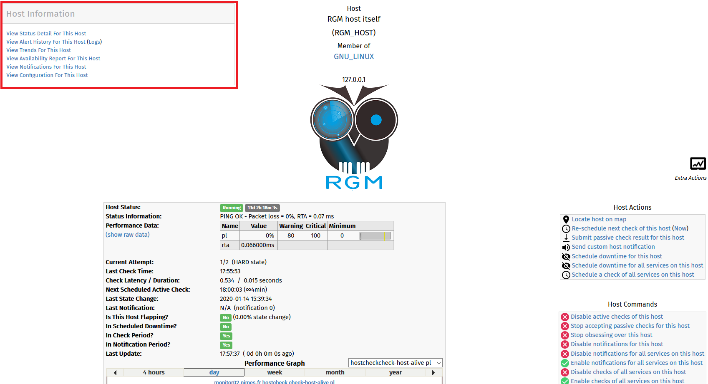
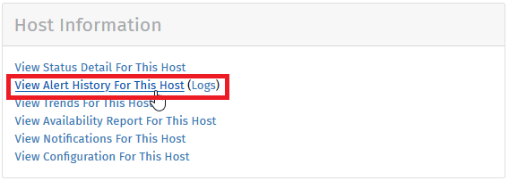
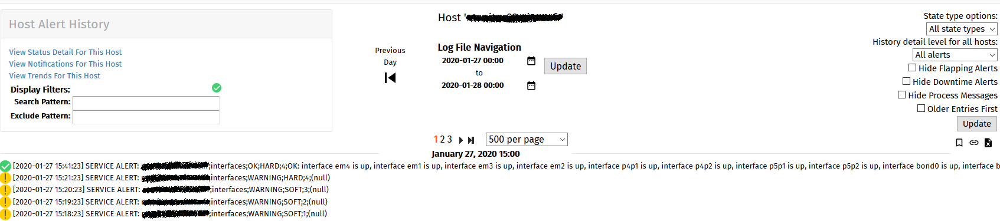

# View host history

When you've found specific host (following [Search host from name](search_host_from_name.md)), you could access to his alert history.  
To do that, you must clic on host name in list (as example RGM_HOST) and you'll access to new page such as :

In top left of page, you'll find an area __Host Information__ :

In this area, you'll find a link __View Alert History For This Host__ :

If you click on this link you'll arrive on page with host alerts history list :

## Navigate in host history